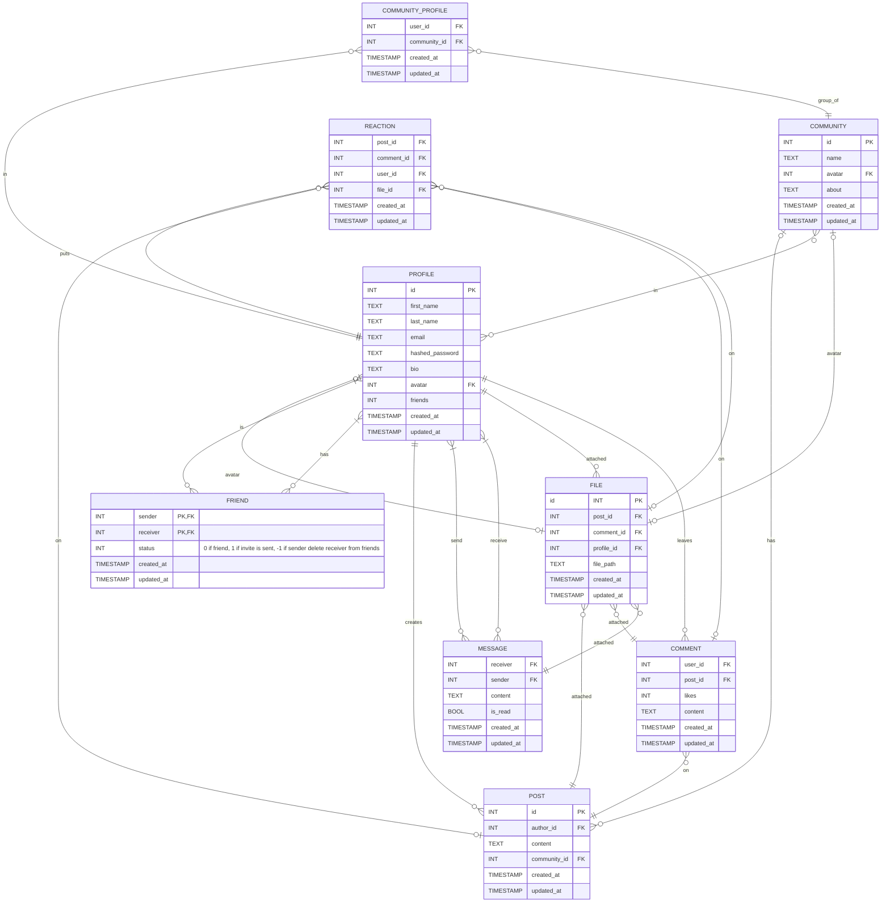

```mermaid
erDiagram
PROFILE one or zero-- one or zero FILE : avatar
PROFILE {
INT id PK
TEXT first_name
TEXT last_name
TEXT email
TEXT hashed_password
TEXT bio
INT avatar FK
INT friends
TIMESTAMP created_at
TIMESTAMP updated_at
}
PROFILE }|--o{ FRIEND : is
PROFILE }|--o{ FRIEND : has
FRIEND {
INT sender PK, FK
INT receiver PK, FK
INT status "0 if friend, 1 if invite is sent, -1 if sender delete receiver from friends"
TIMESTAMP created_at
TIMESTAMP updated_at
}
PROFILE ||--o{ POST : creates
POST {
INT id PK
INT author_id FK
TEXT content
INT community_id FK
TIMESTAMP created_at
TIMESTAMP updated_at
}
PROFILE }|--o{ MESSAGE : send
PROFILE }|--o{ MESSAGE : receive
MESSAGE {
INT receiver FK
INT sender FK
TEXT content
BOOL is_read
TIMESTAMP created_at
TIMESTAMP updated_at
}
COMMUNITY one or zero--o{ POST : has
COMMUNITY }o--o{ PROFILE : in
COMMUNITY one or zero -- one or zero FILE : avatar
COMMUNITY {
INT id PK
TEXT name
INT avatar FK
TEXT about
TIMESTAMP created_at
TIMESTAMP updated_at
}
COMMUNITY_PROFILE }o--|| PROFILE : in
COMMUNITY_PROFILE }o--|| COMMUNITY : group_of
COMMUNITY_PROFILE {
INT user_id FK
INT community_id FK
TIMESTAMP created_at
TIMESTAMP updated_at
}
REACTION }o--|| PROFILE : puts
REACTION }o--one or zero POST : on
REACTION }o--one or zero COMMENT : on
REACTION }o--one or zero FILE : on
REACTION {
INT post_id FK
INT comment_id FK
INT user_id FK
INT file_id FK
TIMESTAMP created_at
TIMESTAMP updated_at
}
COMMENT }o--|| PROFILE : leaves
COMMENT }o--|| POST : on
COMMENT {
INT user_id FK
INT post_id FK
INT likes
TEXT content
TIMESTAMP created_at
TIMESTAMP updated_at
}
FILE }o--|| PROFILE : attached
FILE }o--|| POST : attached
FILE }o--|| COMMENT : attached
FILE }o--|| MESSAGE : attached
FILE {
id INT PK
INT post_id FK
INT comment_id FK
INT profile_id FK
TEXT file_path
TIMESTAMP created_at
TIMESTAMP updated_at
}
```